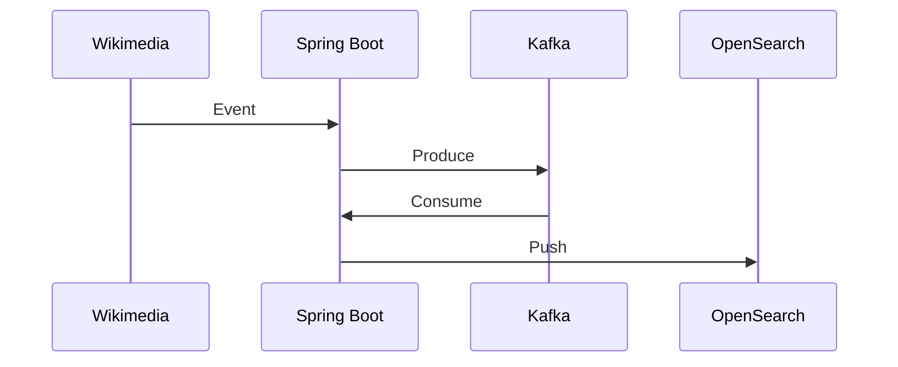

# Kafka with Spring Boot Webflux

This project to demonstrate how to integrate with Kafka in Spring Boot.

## Overview



This application will fetch events from wikimedia SSE and push into Kafka topic `wikimedia.recentchange`.
Also consume message from this topic and push into OpenSearch.

### Getting Started

1. **Clone the repository:**
    ```sh
    git clone https://github.com/up2code/spring-wikimedia-kafka.git
    cd spring-wikimedia-kafka
    ```

2. **Start the Docker containers:**
    ```sh
    docker-compose up -d
    ```

3. **Build the project:**
    ```sh
    ./mvnw clean install
    ```

4. **Run the application:**
    ```sh
    ./mvnw spring-boot:run
    ```

### Accessing the Application

- The application will be running at: `http://localhost:38080` (Change port at `src/main/resources/application.properties`)
- OpenSearch: `http://localhost:5601`
- Kafka UI: `http://localhost:8080`

